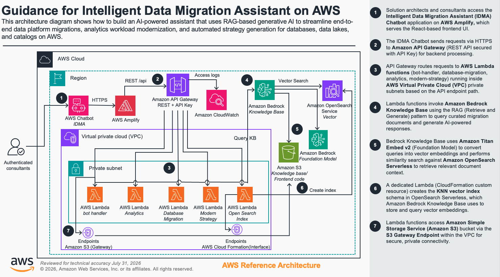
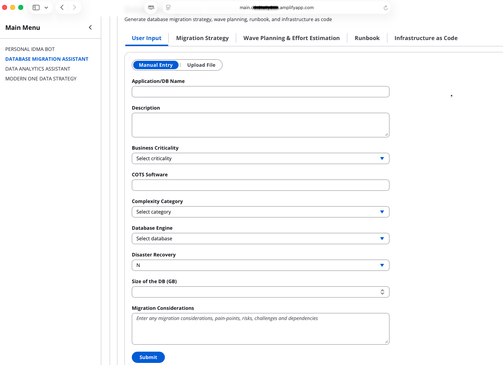
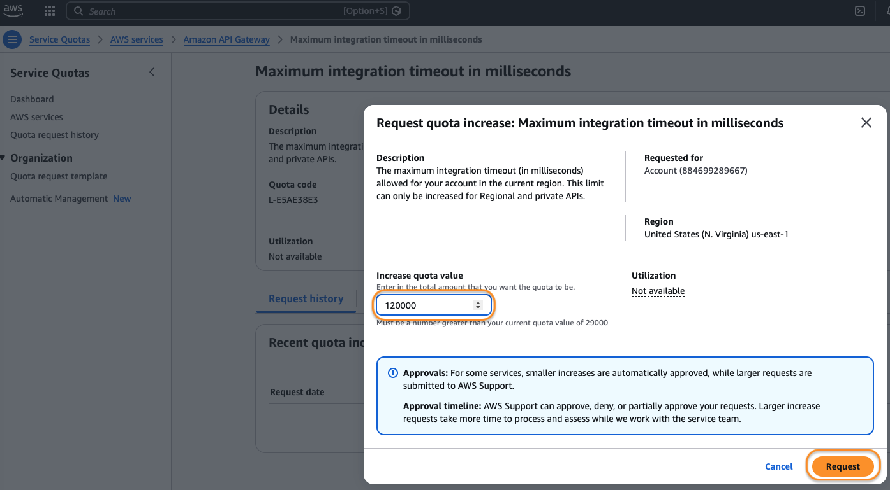

# Guidance for Intelligent Data Migration Assistant on AWS

## Table of Contents

1. [Overview](#overview)
    - [Cost](#cost)
2. [Prerequisites](#prerequisites)
    - [Operating System](#operating-system)
3. [Deployment Steps](#deployment-steps)
4. [Deployment Validation](#deployment-validation)
5. [Running the Guidance](#running-the-guidance)
6. [Next Steps](#next-steps)
7. [Cleanup](#cleanup)
8. [Notices](#notices)
9. [FAQ, known issues, additional considerations, and limitations](#faq-known-issues-additional-considerations-and-limitations)
10. [Authors](#authors)

## Overview

### Why did we build this Guidance?

Database migration projects are often delayed and over budget due to complex legacy systems, lack of prescriptive guidance, and resource-intensive planning. Beyond migrations, organizations also struggle to define modern data strategies and select the right analytics services for their workloads. We built this Guidance to help Solution Architects and Consultants accelerate migration planning, analytics workload assessments, and modern data strategy development using AI - reducing manual effort and providing tailored, actionable recommendations from day one.


### What problem does this Guidance solve?

The Intelligent Data Migration Assistant (IDMA) on AWS is a comprehensive Guidance that revolutionizes enterprise database migrations to AWS by leveraging AI capabilities to address complex migration challenges. This Guidance was developed to solve critical pain points in database migration projects, including project delays, unexpected costs, legacy system compatibility issues, and resource-intensive planning processes.

IDMA transforms the traditional migration approach by providing:

- AI-powered migration pattern generation tailored to specific organizational needs 
- Automated, prescriptive guidance for various database types
- Industry-specific migration pathways with security considerations
- Detailed implementation runbooks and Infrastructure as Code (IaC)
- Cost estimation and wave planning capabilities

### What AWS Services does this Guidance use?

* [Amazon Bedrock](https://aws.amazon.com/bedrock/)
* [Amazon OpenSearch Service](https://aws.amazon.com/opensearch-service/)
* [AWS CloudFormation](https://aws.amazon.com/cloudformation/)
* [Amazon Simple Storage Service (Amazon S3)](https://aws.amazon.com/s3/)
* [AWS Secrets Manager](https://aws.amazon.com/secrets-manager/)
* [AWS Key Management Service (KMS)](https://aws.amazon.com/kms/)

### How does this Guidance work?

Migrating enterprise databases to AWS brings immense opportunities, however also complex challenges around legacy compatibility, security, costs and more. An incorrect migration strategy would cause significant delays in project timelines, additional efforts, thus increases the overall cost of the project and unpleasant customer experience.IDMA tackles these head-on with an AI-powered migration pattern generator tailored for wide array of databases catering each organization's and industry unique needs with prescriptive guidance on migration strategy and high level steps for migration.

<b>Solution</b> : IDMA tackles the challenges of database migration  head-on with an AI-powered migration pattern generator tailored for wide array of databases catering each organization's and industry unique needs with prescriptive guidance on migration strategy and high level steps for migration.

<b>Scope</b> : Currently supported for database specific migrations and follow-up Interactions.

<b>Input</b> :  A question/requirement in the form of text/inventory sheet or an On Premise/Source Architecture diagram

<b>Output</b>  :  Migration strategy with path and high level steps in the form of runbook, Infrastructure as Code(IaC), Wave planning with ball park costing

<b>Personas</b> :  Solution Architects, Consultants, CDA’s, 

<b>Out of Scope</b> :  Application/Middle tier stack

The architecture diagram provides an overview of the system setup and the components involved in the migration process.  

     

## Key Features 
<b>Automated Migration Strategy Suggestions</b> :
AI-driven insights for optimal migration paths.

<b>IaC Code Generator</b> : 
Automatically generates Infrastructure as Code for seamless AWS deployment.

<b>Runbook Creation</b> :
Detailed, automated runbooks to ensure smooth migration processes.

<b>Wave Planning</b> :
Strategic planning of migration phases to minimize disruptions.

<b>Effort Estimation</b> :
Accurate estimation of time and resources required for migration.

  

### Cost

You are responsible for the cost of the AWS services used while running this Guidance. Pricing is indicative (us-east-1, on-demand, mid-2026 public rates). Actual cost depends on real usage. Free-tier / no-charge resources (IAM roles & policies, VPC, subnets, route tables, internet gateway, security groups) are excluded from the billed rows. 

We recommend creating a Budget through AWS Cost Explorer to help manage costs. Prices are subject to change. For full details, refer to the pricing webpage for each AWS service used in this Guidance.

The cost for running this Guidance with the default settings in the `us-east-1` (US East Region (N. Virginia)) is approximately $750 per month for processing.

| AWS service | Dimensions | Cost [USD] |
| --- | --- | --- |
| Amazon API Gateway (REST) | 1,000,000 REST API calls per month | $3.50/month |
| AWS Lambda | 5 functions, 128–512 MB, ~1M invocations/month, ~200 ms avg | $0.00–$2.00/month (largely free tier) |
| Amazon Bedrock – Titan Text Embeddings V2 | Embedding 1,000,000 input tokens (ingestion) | $0.02 per 1M tokens ≈ $0.02/month |
| Amazon Bedrock – Foundation model (RAG query) | 1,000 queries, ~2K in / 500 out tokens each (e.g. Claude) | Model-dependent (~$5–$20/month) |
| Amazon OpenSearch Serverless | Vector store, min 2 OCU (index) + 2 OCU (search) = 4 OCU | 4 OCU × $0.24/OCU-hr × 730 hr ≈ $700/month |
| AWS Amplify Hosting | App + branch; 5 GB stored, 15 GB served, 1,000 build min | ~$1.50/month |
| NAT Gateway | 1 gateway × 730 hr + 10 GB processed | (730 × $0.045) + (10 × $0.045) ≈ $33.30/month |
| Elastic IP (EIP) | 1 EIP attached to NAT Gateway | $0.00 (in-use) |
| VPC Interface Endpoint (CloudFormation) | 1 endpoint × 1 AZ × 730 hr + minimal data | ~$7.30/month |
| VPC Gateway Endpoint (S3) | 1 gateway endpoint | $0.00 (no hourly charge) |
| AWS KMS | 1 customer-managed key + ~20,000 requests | $1.00 + ~$0.06 ≈ $1.06/month |
| Amazon CloudWatch Logs | VPC Flow Logs + Lambda logs, ~5 GB ingest + 5 GB store | (5 × $0.50) + (5 × $0.03) ≈ $2.65/month |

## Notable Cost Drivers

- **Amazon OpenSearch Serverless** — the minimum 4-OCU floor dominates the bill at ~$700/month.
- **NAT Gateway** — ~$33/month for a single gateway (hourly + data processing).
- **Amazon Bedrock foundation-model inference** — cost scales entirely with query volume and chosen model.


## Prerequisites

### Operating System

These deployment instructions are optimized to best work on **Amazon Linux 2023** or **macOS**. Deployment on Windows may require additional steps (e.g. using WSL).

The following packages are required and must be installed before deployment:

| Package | Version | Install Command |
| --- | --- | --- |
| Python | 3.12 | `sudo yum install python3.12` |
| pip | latest | `sudo yum install python3-pip` |
| Node.js | 20+ | `sudo yum install nodejs20` |
| npm | 9.x+ | Included with Node.js |
| AWS CLI | v2 | `sudo yum install awscli` |
| jq | 1.6+ | `sudo yum install jq` |
| zip | latest | `sudo yum install zip` |
| unzip | latest | `sudo yum install unzip` |
| git | latest | `sudo yum install git` |


### Third-party tools

The following third-party Python packages are required:
- **Python 3.x** — Runtime environment (with `venv` package available)
- **opensearch-py** — OpenSearch client for vector store operations
- **spacy** — NLP library for text processing
- **click** — CLI framework for deployment scripts

### AWS Account Requirements

The following must be configured in your AWS account before deployment:

- **AWS CLI** configured with credentials (`aws configure`)
- **IAM permissions** to create and manage: Lambda, API Gateway, OpenSearch Serverless, Bedrock, S3, Amplify, CloudFormation, KMS, Secrets Manager, VPC, IAM Roles and Policies
- **Amazon Bedrock** foundation model access enabled for:
  - `amazon.titan-embed-text-v2:0` (embeddings)
  - `us.anthropic.claude-sonnet-5` (inference)
- **API Gateway quota increase** — Maximum integration timeout increased to `120,000 ms` (default is 29,000 ms). See [Increase API Gateway Timeout Limit](#increase-api-gateway-timeout-limit)

#### Increase API Gateway Timeout Limit

This step is critical to complete before deployment as the CloudFormation stack uses a timeout of 120,000 milliseconds.

1. Navigate to AWS Service Quotas:
   - Go to **AWS Console**
   - Search for **Service Quotas**
   - Select **Amazon API Gateway** from *Manage quotas* drop down

2. Search **Maximum integration timeout**:
   ```
   Quota name: Maximum integration timeout in milliseconds
   Quota code: L-E5AE38E3
   Default value: 29,000 milliseconds
   ```

3. Request quota increase:
   - Click **Request quota increase**
   - Enter desired value (recommended: 120000)
   - Click on **Request** and wait for approval

  

Note: Quota increase requests may take time to be approved. Plan your deployment accordingly.

### Supported Regions

This guidance has been tested in **us-east-1** region.

## Deployment Steps

This Guidance offers a **one-click deployment** feature, leveraging AWS CloudFormation to provision all necessary resources, including:
- Amazon Virtual Private Cloud (VPC) with public and private subnets
- NAT Gateway and Internet Gateway
- Security Groups
- IAM Roles and Policies
- VPC Endpoints (S3 Gateway and CloudFormation Interface)
- Amazon OpenSearch Serverless Collection and Vector Index
- Amazon Bedrock Knowledge Base and Data Source
- AWS Lambda Functions and Layers
- Amazon API Gateway (REST) with Usage Plan and API Key
- AWS Amplify Application and Branch
- AWS Secrets Manager (Basic Auth credentials)
- AWS KMS Key for CloudWatch Logs encryption
- Amazon CloudWatch Log Groups and VPC Flow Logs

### 1. Clone the Repository

```bash 
git clone git@github.com:aws-solutions-library-samples/guidance-for-intelligent-data-modernization-assistant-on-aws.git
```

### 2. Set Up Python Virtual Environment
```bash
# Navigate to your local git repository folder

cd <YOUR-LOCAL-GIT-FOLDER>/guidance-for-intelligent-data-modernization-assistant-on-aws/deployment

# Create virtual environment
python3.12 -m venv idma-venv

# Activate virtual environment
# For Unix or MacOS:
source idma-venv/bin/activate
# For Windows:
# .\idma-venv\Scripts\activate

# Install required Python packages
pip install boto3 opensearch-py botocore pathlib spacy click awscli
```

Note: Always use the virtual environment when installing Python packages to avoid "externally-managed-environment" errors.

### 3. Project Structure
Ensure your project structure looks some what like this:
```
guidance-for-intelligent-data-modernization-assistant-on-aws/
   ├── frontend/
   ├── backend/
   │   ├── functions/
   │   └── lambda-layer/
   ├── deployment/
       ├── deployment.sh
       ├── createKb.py
       └── template.yaml
   
── [other files]
```

### 4. Deployment Process

1. Make the deployment script executable:
```bash
cd deployment
chmod +x deployment.sh
```

2. Run the deployment script:
```bash
./deployment.sh
```

The deployment script will automatically:
- Create necessary S3 buckets
- Set up the Knowledge Base
- Package and upload Lambda functions
- Deploy the CloudFormation stack
- Build and deploy the frontend
- Deploy to AWS Amplify

### 5. Monitor Deployment

During deployment, you'll see color-coded progress messages:
- 🟡 Yellow: Status/Progress messages
- 🟢 Green: Success messages
- 🔴 Red: Error messages

The complete deployment typically takes 15-20 minutes.

### 6. Deployment Completion

When deployment is successful, you'll see:
```
Deployment Complete!
================================
API Endpoint: [Your API endpoint URL]
Frontend Bucket: [Your frontend bucket name]
Knowledge Base Bucket: [Your KB bucket name]
Amplify Domain: [Your Amplify domain]
Amplify Console URL: [Your Amplify console URL]
--------------------------------
Basic auth username: idmaadmin
Retrieve the password with:
  aws secretsmanager get-secret-value --secret-id [secret ARN] ...
================================
```

Save these URLs for future reference.

### 7. Accessing the Application

The Amplify-hosted frontend is protected by HTTP basic authentication. CloudFormation
generates a random 32-character password at deploy time and stores it in AWS Secrets
Manager — it is never written to the repository, the build output, or the deployment logs.

Retrieve the credentials:

```bash
SECRET_ARN="$(aws cloudformation describe-stacks \
    --stack-name idma-deployment-stack \
    --region us-east-1 \
    --query 'Stacks[0].Outputs[?OutputKey==`BasicAuthSecretArn`].OutputValue' \
    --output text)"

aws secretsmanager get-secret-value \
    --secret-id "${SECRET_ARN}" \
    --region us-east-1 \
    --query SecretString --output text | jq -r '"\(.username) / \(.password)"'
```

Open the Amplify Domain URL in a browser and enter the username and password when prompted.

To change the username, override the `BasicAuthUsername` parameter (set via
`BASIC_AUTH_USERNAME` in `deployment.sh`) and redeploy.

#### Rotating the password

CloudFormation resolves the secret only during a stack operation, so Amplify keeps
serving the old password until the stack is updated. After changing the secret value,
re-run `./deployment.sh` (or apply it directly with
`aws amplify update-branch --app-id <id> --branch-name main --basic-auth-credentials <base64 user:password>`).

> **Note:** Basic auth protects the hosted frontend only. The API Gateway endpoints are
> still reachable directly. For a stronger posture, add an authorizer to the API methods
> (see [SECURITY.md](./SECURITY.md)).

## Deployment Validation

### 1. Verify CloudFormation Stack Created

## Deployment Validation

### 1. Verify CloudFormation Stack
Run the following CLI command to validate the deployment:
```bash
aws cloudformation describe-stacks \
    --stack-name idma-deployment-stack \
    --region us-east-1 \
    --query 'Stacks[0].StackStatus'
```

Expected output: **"CREATE_COMPLETE"**

### 2. Verify Individual Resources
Run the following commands to validate key resources:

```bash
# Verify Lambda functions
aws lambda list-functions --region us-east-1 \
    --query 'Functions[?starts_with(FunctionName, `idma`)].FunctionName'

# Verify OpenSearch Serverless Collection
aws opensearchserverless list-collections --region us-east-1 \
    --query 'collectionSummaries[?starts_with(name, `vs-`)].{Name:name,Status:status}'

# Verify Bedrock Knowledge Base
aws bedrock-agent list-knowledge-bases --region us-east-1 \
    --query 'knowledgeBaseSummaries[?starts_with(name, `idma-kb`)].{Name:name,Status:status}'

# Verify Amplify App
aws amplify list-apps --region us-east-1 \
    --query 'apps[?starts_with(name, `idma`)].{Name:name,DefaultDomain:defaultDomain}'
```

### 3. Access the Application
1. Retrieve the Amplify domain from the CloudFormation outputs:
```bash
aws cloudformation describe-stacks \
    --stack-name idma-deployment-stack \
    --region us-east-1 \
    --query 'Stacks[0].Outputs[?OutputKey==`AmplifyDomain`].OutputValue' \
    --output text
```
2. Open the URL in a browser — you should see the IDMA login prompt
3. Retrieve credentials using the command in [Accessing the Application](#7-accessing-the-application)

## Running the Guidance

### Inputs
The IDMA accepts the following input types:

| Input Type | Description | Example |
| --- | --- | --- |
| Text Query | Natural language question about database migration | *"How do I migrate Oracle to Aurora PostgreSQL?"* |
| Inventory Sheet | CSV/Excel file listing source databases | Database name, type, size, dependencies |
| Architecture Diagram | On-premise or source architecture image | JPG/PNG of current database architecture |

### 1. Access the Application
Open the Amplify domain URL in a browser and log in with the credentials retrieved from Secrets Manager (see [Accessing the Application](#7-accessing-the-application)).

### 2. Using the IDMA Bot
1. Navigate to **PERSONAL IDMA BOT** from the left menu
2. Enter your migration query in the chat input
3. Submit and wait for the AI-generated response

Expected output:
- Migration strategy with recommended path
- High-level migration steps
- Relevant AWS service recommendations

### 3. Using the Database Migration Assistant
1. Navigate to **DATABASE MIGRATION ASSISTANT** from the left menu
2. Enter your source and target database details
3. Submit to generate:
   - Detailed migration runbook
   - Infrastructure as Code (IaC)
   - Wave planning with effort estimation
   - Ballpark cost estimate

### 4. Using the Data Analytics Assistant
1. Navigate to **DATA ANALYTICS ASSISTANT** from the left menu
2. Enter your analytics workload details
3. Submit to receive AWS analytics service recommendations and migration guidance

### 5. Using the Modern Data Strategy
1. Navigate to **MODERN ONE DATA STRATEGY** from the left menu
2. Describe your current data landscape and goals
3. Submit to receive a tailored modern data strategy on AWS

### Sample Query
```
Source: Oracle 19c on-premise, 2TB, OLTP workload
Target: AWS Cloud
Industry: Financial Services
Requirements: High availability, minimal downtime
```

Expected output:
```
Migration Strategy: Oracle 19c to Amazon RDS for Oracle (homogenous) or Aurora PostgreSQL (heterogenous)
Recommended Path: AWS DMS for continuous replication + Oracle Data Pump for initial data load
High Availability: Multi-AZ RDS deployment or Oracle Data Guard on EC2
Cutover Plan: Final data sync → application repointing → validation → stakeholder sign-off
Post-Migration: Amazon CloudWatch monitoring, automated backups, and failover testing
```

## Next Steps 

### Extend the Knowledge Base
- Include industry-specific compliance and security documents for tailored migration guidance. Amazon Bedrock Knowledge Bases supports `.pdf`, `.txt`, `.md`, `.html`, `.doc`/`.docx`, `.csv`, and `.xls`/`.xlsx` files up to 50 MB each — see [Supported document formats and limits](https://docs.aws.amazon.com/bedrock/latest/userguide/knowledge-base-ds.html#kb-ds-supported-doc-formats-limits)
- Add domain-specific migration documents to the `knowledge_base/` directory, then upload them to the Knowledge Base bucket and start an ingestion job. Run this from the repository root:

  ```bash
  cd <YOUR-LOCAL-GIT-FOLDER>/guidance-for-intelligent-data-modernization-assistant-on-aws/

  REGION=us-east-1
  KB_BUCKET="idma-kb-$(aws sts get-caller-identity --query Account --output text)-${REGION}-dev"

  aws s3 sync knowledge_base "s3://${KB_BUCKET}/knowledge_base/"

  KBID=$(aws cloudformation describe-stacks --stack-name idma-deployment-stack --region "${REGION}" \
    --query 'Stacks[0].Outputs[?OutputKey==`KnowledgeBaseId`].OutputValue' --output text)
  DSID=$(aws cloudformation describe-stacks --stack-name idma-deployment-stack --region "${REGION}" \
    --query 'Stacks[0].Outputs[?OutputKey==`DataSourceId`].OutputValue' --output text)

  aws bedrock-agent start-ingestion-job --knowledge-base-id "${KBID}" \
    --data-source-id "${DSID}" --region "${REGION}"
  ```

  Ingestion is incremental — Bedrock only embeds new or changed files. Track progress with
  `aws bedrock-agent list-ingestion-jobs --knowledge-base-id "${KBID}" --data-source-id "${DSID}" --region "${REGION}" --max-results 1`,
  or use **Bedrock → Knowledge bases → your KB → Data source → Sync** in the console.

### Add API Security
- Add an API Gateway authorizer (Lambda or Cognito) to protect the API endpoints — currently the API Gateway methods have `AuthorizationType: NONE`
- See [SECURITY.md](./SECURITY.md) for guidance

### Scale for Production
- Replace `StandbyReplicas: DISABLED` with `ENABLED` in the OpenSearch Serverless collection for high availability
- Increase Lambda `ReservedConcurrentExecutions` and `MemorySize` based on expected traffic
- Enable API Gateway caching on the `ApiStage` to reduce Bedrock invocation costs

### Switch to a Different Foundation Model
- Update `REACT_APP_MODEL_ARN` in `frontend/.env` and the `ModelArn` in the CFT to use a different Amazon Bedrock supported model (e.g. `amazon.nova-pro-v1`)
- Ensure the new model is enabled in your AWS account under Amazon Bedrock → Model Access

### Multi-Region Deployment
- The guidance is currently tested in `us-east-1` — to deploy in another region, update `REGION` in `deployment.sh` and verify Amazon Bedrock model availability in that region

### CI/CD Pipeline
- Integrate `deployment.sh` into a CI/CD pipeline (e.g. AWS CodePipeline) to automate frontend and backend deployments on code changes

## Cleanup

To remove all deployed resources:

NOTE: First empty the *Amazon S3 buckets* (**idma-react-*** and **idma-kb-***) created by the deployment. See the S3 documentation for instructions on emptying buckets: https://docs.aws.amazon.com/AmazonS3/latest/userguide/empty-bucket.html


```bash
# Empty and delete S3 buckets. The buckets name starts with idma-kb-*, idma-lambda-* and idma-react-* respectively:

aws s3 rm s3://idma-kb-<aws-account-number>-<region>-<env> --recursive
aws s3 rm s3://idma-lambda-<aws-account-number>-<region>-<env> --recursive
aws s3 rm s3://idma-react-<aws-account-number>-<region>-<env> --recursive

aws s3api delete-bucket --bucket idma-kb-<aws-account-number>-<region>-<env>
aws s3api delete-bucket --bucket idma-lambda-<aws-account-number>-<region>-<env>
aws s3api delete-bucket --bucket idma-react-<aws-account-number>-<region>-<env>

# Delete CloudFormation stack
aws cloudformation delete-stack --stack-name idma-deployment-stack
```

NOTE: Deleting the stack puts the basic auth secret into a 30-day recovery window rather
than removing it. The secret name includes the deployment's random prefix, so this does not
block a fresh deployment. If you want to remove it immediately:

```bash
aws secretsmanager delete-secret \
    --secret-id idma-deployment-stack-amplify-basicauth-dev-<random-prefix> \
    --force-delete-without-recovery \
    --region us-east-1
```


## FAQ, known issues, additional considerations, and limitations

### Known Issues

1. **Python Package Installation Errors**
```bash
# If you see externally-managed-environment error:
# Make sure you're using the virtual environment:
source idma-venv/bin/activate
```

2. **AWS CLI Errors**
```bash
# Verify AWS configuration:
aws sts get-caller-identity
```

3. **Deployment Script Permission Error**
```bash
# If deployment.sh lacks execution permission:
chmod +x deployment.sh
```

4. **Amazon S3 Bucket Name Conflicts**
- The script automatically generates unique bucket names
- If you see bucket name conflicts, check the AWS Console and delete unused buckets

5. **Stack deletion fails on `OpenSearchIndex`**

```bash
# If OpenSearchIndex fails with `CloudFormation did not receive a response from your Custom Resource.` during clean up. Follow these steps:

# 5.1 Find the custom resource Lambda (name has opensearch-index-function suffix)
aws lambda list-functions --region us-east-1 \
  --query "Functions[?contains(FunctionName, 'opensearch-index-function')].[FunctionName,LastModified,Runtime]" \
  --output table

# 5.2 Delete it
aws lambda delete-function --region us-east-1 \
  --function-name <name-from-above>

# 5.3 Retry the stack deletion
aws cloudformation delete-stack --stack-name idma-deployment-stack
```

### Environment Variables

The deployment script sets these variables automatically, but if needed they can be set manually:
```bash
export AWS_REGION="us-east-1"  # or your preferred region
export ENVIRONMENT="dev"
```

### Support

For additional support:
1. Check *AWS CloudWatch* logs
2. Review *CloudFormation* events
3. Check *Amplify* build logs

### Security Note

- Never commit *AWS credentials* to version control
- Store sensitive information in secure *parameter stores/vaults*
- Follow *least-privilege* principle when configuring *IAM roles*
- Regularly rotate credentials and review permissions

## Notices

Customers are responsible for making their own independent assessment of the information in this Guidance. This Guidance: (a) is for informational purposes only, (b) represents AWS current product offerings and practices, which are subject to change without notice, and (c) does not create any commitments or assurances from AWS and its affiliates, suppliers or licensors. AWS products or services are provided “as is” without warranties, representations, or conditions of any kind, whether express or implied. AWS responsibilities and liabilities to its customers are controlled by AWS agreements, and this Guidance is not part of, nor does it modify, any agreement between AWS and its customers.

## Authors

* [Jitendra Kumar](https://www.linkedin.com/in/jitendrkumar/)
* [HariKrishna Boorgadda](https://www.linkedin.com/in/hari-krishna-569b8445/)
* [Vikas Gupta](https://www.linkedin.com/in/vikasg/)
